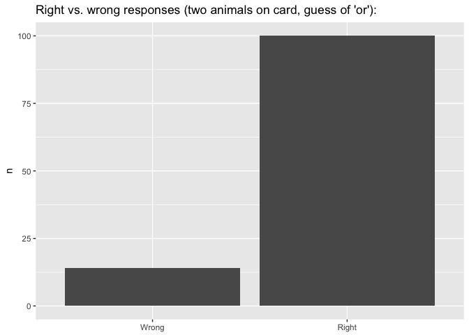

Linking Hypotheses and SI\_Paradigms
================

Some preliminaries:

``` r
require("rwebppl")
require("tidyverse")
require("ordinal")
```

The problem
-----------

The RSA model of a pragmatically competent speaker is a probability distribution of possible utterances given some world state the speaker intends to communicate to a listener. We'd like to be able to link this model to the categorical responses we observe in the SI\_Paradigms experiment. For the purposes of this document, I'll focus on the version of the experiment where speakers rated an utterance on a two-point scale of "Right"/"Wrong".

Setting up the RSA model
------------------------

In the RSA model, the function S1 returns the probability of an utterance given the world state the speaker intends to communicate.

Let's imagine that a speaker is in a scenario where there are exactly three animals - X, Y, and Z - that each might be on some card. We represent all of the possible world states as an nested array, where the array \['X'\] corresponds to the world state where an animal X is on the card (and no other animal is). We define a set of possible sentences a speaker might utter, assuming the speaker intends to communicate which animals are on the card. Next, we attribute meanings to those utterances. Lastly, we define the pragmatic speaker function.

``` r
model = "
var states = [['X'], ['Y'], ['Z'], ['X','Y'], ['X','Z'], ['Y','Z'], ['X','Y','Z']];
var utterances = ['X', 'Y', 'XorY', 'XandY', 'Z','XorZ','XandZ','YorZ','YandZ','XandYandZ','XorYorZ'];

var statePrior = function() {
  return uniformDraw(states)
};

var utterancePrior = function() {
  return uniformDraw(utterances);
};

var literalMeanings = {
  X: function(state) { return state.includes('X'); },
  Y: function(state) { return state.includes('Y'); },
  Z: function(state) { return state.includes('Z'); },
  XorY: function(state) { return state.includes('X') || state.includes('Y'); },
  XandY: function(state) { return state.includes('X') && state.includes('Y'); },
  XorZ: function(state) { return state.includes('X') || state.includes('Z'); },
  XandZ: function(state) { return state.includes('X') && state.includes('Z'); },
  YorZ: function(state) { return state.includes('Y') || state.includes('Z'); },
  YandZ: function(state) { return state.includes('Y') && state.includes('Z'); },
  XorYorZ: function(state) { return state.includes('X') || state.includes('Y') || state.includes('Z'); },
  XandYandZ: function(state) { return state.includes('X') && state.includes('Y') && state.includes('Z'); },
};

var literalListener = cache(function(utt) {
  return Infer({model: function(){
    var state = statePrior()
    var meaning = literalMeanings[utt]
    condition(meaning(state))
    return state
  }})
});

// set speaker optimality
var alpha = 1;

// pragmatic speaker
var speaker = cache(function(state) {
  return Infer({model: function(){
    var utt = utterancePrior()
    factor(alpha * literalListener(utt).score(state))
    return utt
  }})
});
"
```

Sanity check: what is the probability distribution over possible utterances given world state \['X','Y'\]?

``` r
code <- paste(model,"speaker(['X','Y'])",sep="\n")
webppl(code)
```

    ##   support       prob
    ## 1 XorYorZ 0.08695652
    ## 2    YorZ 0.10144928
    ## 3    XorZ 0.10144928
    ## 4   XandY 0.30434783
    ## 5    XorY 0.10144928
    ## 6       Y 0.15217391
    ## 7       X 0.15217391

The empirical picture
---------------------

As we expect, the utterance 'XorY' (i.e. "there is an X or a Y on the card") is of substantially lower probability than utterance 'XandY'. We interpret this to mean that in our model, 'XorY' is not the optimal utterance given that a speaker is trying to communicate the world state denoted by \['X','Y'\] (i.e. both X and Y are on the card).

Consider this output of the model in the context of the following empirical result of the SI\_Paradigms pilot: in the condition where a participant is shown a card with two animals X and Y, people overwhelmingly find a guess of "there is an X or a Y on the card" to be "Right"" rather than "Wrong".



Straw-man linking hypothesis: participants sample 'directly' from S:
--------------------------------------------------------------------

Our linking hypothesis should say something about why an overwhelming majority of individuals would rate an 'XorY' guess to be Right in an \['X','Y'\] world state, despite 'XorY' being a suboptimal utterance choice in this world state according to our pragmatic speaker model.

Let's first explore a linking hypothesis that makes the wrong predictions in this regard. We might hypothesize that speakers, when confronted with a world state w (i.e. the configuration of animals on the card in a given SI\_Paradigms trial) and an utterance u (the guess in that trial), have access to the probability that the S1 distribution assigns to u in w.

``` r
commands <- "
var prob = Math.exp(speaker(['X','Y']).score('XorY'));
prob;"
code <- paste(model,commands,sep="\n")
webppl(code)
```

    ## [1] 0.1014493

On this simplistic straw-man story, we might say that all that happens next is that speakers sample from a Bernoulli distribution where the probability of success is equal to S1(u|w). If that sample is a success, the utterance is rated as Right; if failure, the utterance is rated as Wrong.

``` r
commands <- "
var prob = Math.exp(speaker(['X','Y']).score('XorY'));
sample(Bernoulli({p: prob}));
"
code <- paste(model,commands,sep = "\n")
webppl(code)
```

    ## [1] FALSE

Obviously, this model is going to be a very poor fit for the observed data (we could confirm this easily with a binomial test). It will predict that in the vast majority of cases, participants should actually reject 'XorY' in the \['X','Y'\] condition. Moreover, it's unclear how to extend this linking hypothesis to the experimental conditions in which there are more than two possible responses. Lastly, it doesn't even get the qualitative pattern of responses right for the binary-choice experiment. For example, in the conditions where there were two animals X and Y on the card, it was possible that speakers had to rate a guess of 'X or Y' or a guess of just 'X'. However, across both of these guess types, the proportion of "Right" responses among pilot participants is nearly identical -- despite the RSA model prediction that 'X' should be a substantially more optimal utterance than 'X or Y' in this world state. On the naive story built up so far, it is unclear as to why this would be the case.


A better hypothesis? The logistic function
------------------------------------------

The straw-man linking hypothesis described above was clearly inadequate. But it is a linking hypothesis: it generates predictions about categorical behavior (e.g. responses in the SI\_Paradigms experiment) from our model; it "maps the response measure onto the theoretical constructs of interest" (Tanenhaus 2000:564-5). The above hypothesis achieves this by positing that the categorical behavior of interest (answering "Right"/"Wrong"") can be understood as a probabilistic process, whereby the probability that a participant responds "Right" when exposed to utterance u in world state w is equal to the speaker proabibility of u in w as computed by the RSA model:

P(Participant answers "Right"|u,w) = S1(u|w)

Perhaps the straw-man hypothesis is basically correct in conceptualizing the categorical response as a probabilistic process. If we accept the basic story that the categorical response can be represented as P("Right"|u,w), then we need a way to link P("Right"|u,w) to our RSA speaker distribution S1(u|w) - in a way that gets better empirical coverage than the straw-man hypothesis explored above.

One alternative would be to say that P("Right"|u,w) is a function of, but not identical to, the probability of utterance u given world state w in the S1 model. The challenge then becomes to specify this function. Logistic regression provides one possible solution. This type of regression returns a model of the log odds of some binary categorical response (e.g. "Right"/"Wrong") as a function of an independent variable (e.g. speaker probability of utterance given a world state).

Exploring this requires some transformation to our results. We continue to look at the subset of the SI\_paradigms pilot data where response was binary "Right"/"Wrong". Now, for every row in the data (each row corresponds to one response), we add a value S1(u|w) in a new column (speaker\_probability) of the data frame, where S1(u|w) is the speaker probability of u (the 'guess' presented on the screen) given w (the configuration of animals on the card).

``` r
binary <- filter(d, type == "binary")
binary <- add_column(binary, speaker_probability = 0)

code <- paste(model,"speaker(['X','Y'])",sep="\n")
speaker_probs_xy <- webppl(code)

code <- paste(model,"speaker(['X'])",sep="\n")
speaker_probs_x <- webppl(code)

for(i in 1:nrow(binary)){
  for(j in 1:nrow(speaker_probs_xy)){
    if((as.character(speaker_probs_xy[j,]$support) == as.character(binary[i,]$guess_type)) & binary[i,]$card_type == "XY"){
      binary[i,]$speaker_probability <- speaker_probs_xy[j,]$prob
    }
  }
}

for(i in 1:nrow(binary)){
  for(j in 1:nrow(speaker_probs_x)){
    if((as.character(speaker_probs_x[j,]$support) == as.character(binary[i,]$guess_type))& binary[i,]$card_type == "X"){
      binary[i,]$speaker_probability <- speaker_probs_x[j,]$prob
    }
  }
}
```

Now, specify a logistic regression model whereby categorical response (coded as "1" or "0" in the data set) is predicted by speaker\_probability.

``` r
l <- glm(as.factor(response) ~ speaker_probability, data = binary, family = "binomial")
summary(l)
```

    ## 
    ## Call:
    ## glm(formula = as.factor(response) ~ speaker_probability, family = "binomial", 
    ##     data = binary)
    ## 
    ## Deviance Residuals: 
    ##     Min       1Q   Median       3Q      Max  
    ## -3.3016  -0.3462   0.0119   0.0928   2.3852  
    ## 
    ## Coefficients:
    ##                     Estimate Std. Error z value Pr(>|z|)    
    ## (Intercept)          -2.7846     0.2216  -12.57   <2e-16 ***
    ## speaker_probability  35.8617     2.3776   15.08   <2e-16 ***
    ## ---
    ## Signif. codes:  0 '***' 0.001 '**' 0.01 '*' 0.05 '.' 0.1 ' ' 1
    ## 
    ## (Dispersion parameter for binomial family taken to be 1)
    ## 
    ##     Null deviance: 1228.76  on 912  degrees of freedom
    ## Residual deviance:  352.93  on 911  degrees of freedom
    ## AIC: 356.93
    ## 
    ## Number of Fisher Scoring iterations: 7

``` r
#confint(l)
```

The above model provides the log odds of responding "Right" vs. "Wrong" as a function of the speaker probability of the utterance being assessed by the participant (in a particular utterance context). It is a better model than the simple straw-man model which assumed a one-to-one correspondance between a) the probability a participant judges some utterance u to be "Right" in w and b) the probability of that utterance u in a world state w, as according to our pragmatic speaker distribution \[say more? model comparison?\].

### Extending the logistic regression model to other SI\_Paradigms conditions, e.g. quatenary response

``` r
quatenary <- filter(d, type == "quatenary")
quatenary <- add_column(quatenary, speaker_probability = 0)

for(i in 1:nrow(quatenary)){
  for(j in 1:nrow(speaker_probs_xy)){
    if((as.character(speaker_probs_xy[j,]$support) == as.character(quatenary[i,]$guess_type)) & quatenary[i,]$card_type == "XY"){
      quatenary[i,]$speaker_probability <- speaker_probs_xy[j,]$prob
    }
  }
}

for(i in 1:nrow(quatenary)){
  for(j in 1:nrow(speaker_probs_x)){
    if((as.character(speaker_probs_x[j,]$support) == as.character(quatenary[i,]$guess_type))& quatenary[i,]$card_type == "X"){
      quatenary[i,]$speaker_probability <- speaker_probs_x[j,]$prob
    }
  }
}

lq <- clmm2(ordered(response) ~ speaker_probability, data = quatenary,link = "logistic")
summary(lq)
```

    ## Call:
    ## clm2(location = ordered(response) ~ speaker_probability, data = quatenary, 
    ##     link = "logistic")
    ## 
    ## Location coefficients:
    ##                     Estimate Std. Error z value Pr(>|z|)  
    ## speaker_probability 20.2446   1.2476    16.2271 < 2.22e-16
    ## 
    ## No scale coefficients
    ## 
    ## Threshold coefficients:
    ##     Estimate Std. Error z value
    ## 0|1  1.0327   0.1498     6.8946
    ## 1|2  1.7402   0.1713    10.1589
    ## 2|3  3.8848   0.2504    15.5137
    ## 
    ## log-likelihood: -392.1749 
    ## AIC: 792.3498 
    ## Condition number of Hessian: 273.5264

``` r
#confint(lq)
```

Another hypothesis: thresholds
------------------------------

Another conceivable hypothesis is that for some utterance u in world state w, u is "Right" so long as S1(u|w) exceeds some probability threshold *θ*.

Another hypothesis: mixing log odds + the threshold parameter
-------------------------------------------------------------

Yet another possibility is that for some utterance u in world state w, P("Right"|u,w) is a function of S1'(u|w), where S1' is a transformation of the pragmatic speaker distribution. More specifically, S1' is a renormalized version of S1 after low-probability utterances are removed from S1 (according to some threshold of 'low' probability).
