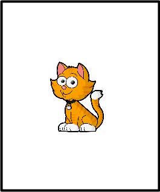
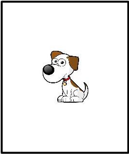

# Design

## Card Types

There are three animals in the card-game: cat, dog, and elephant. Each card may have one or two of them. I represent the card types in the following way:

| Representation | Description | Cards |
|---------|-----------|---------------------------|
|**X**| Only one animal on the card |   |
|**XY**| Two animals on the card |  | 

## Guess Types

| Representation | Description | 
|---|------------------------------------------------------------|
| **Z** | The puppet mentions an animal not on the card | 
| **X** | The puppet mentions one of the animals (perhaps the only animal) on the card |
| **XorY** | The puppet mentions both animals on the card and uses the connective "or" |
| **XandY** | The puppet mentions both animals on the card and uses the connective "and"|

## Trial Types

The combination of card types and guess types creats 12 possible trial types and 36 possible trials. We choose 8 trial types out of 12 to balance for the type of card (X vs. XY), the type of guess (with vs. without connective), and types of responses (wrong, right). We represent each trial type using the pattern "CARD-GUESS" with X, Y and Z abstracting over the specific animals:

| Representation | Example Card | Example Guess |
|---|---|------------------------|
|  **XY-XorY** |  | There is a cat **or** a dog |
| **XY-XandY** | | There is a cat **and** a dog |
| **XY-X** | | There is a cat! |
| **XY-Z** | | There is an elephantl! |
| **X-XorY** | | There is a cat or a dog! |
| **X-XandY** | | There is a cat and a dog! |
|  **X-X** | | There is a cat! |
| **X-Z** | | There is a dog! | 

The table below shows all the 36 possible trials and trial types:

```{r all_trials, message=FALSE, warning=FALSE}
library(dplyr)
library(tidyverse)
library(lubridate)

all_trials <-
  data.frame(
    trial_type = c(rep("XY.XorY", 3), 
                   rep("XY.XandY", 3),
                   rep("XY.X", 6),
                   rep("XY.Z",3),
                   rep("X.XorY", 6),
                   rep("X.XandY", 6),
                   rep("X.X", 3),
                   rep("X.Z", 6)
                   ),
    card = c("CAT-DOG", "CAT-ELE", "DOG-ELE", 
              "CAT-DOG", "CAT-ELE", "DOG-ELE",
              "CAT-DOG", "CAT-DOG", "CAT-ELE", "CAT-ELE", "DOG-ELE", "DOG-ELE",
              "CAT-DOG", "CAT-ELE", "DOG-ELE",
              "CAT", "DOG", "CAT", "ELE", "DOG", "ELE",
              "CAT", "DOG", "CAT", "ELE", "DOG", "ELE",
              "CAT", "DOG", "ELE",
              "CAT", "CAT", "DOG", "DOG", "ELE", "ELE"),
    guess = c("cat or dog", "cat or elephant", "dog or elephant",
              "cat and dog", "cat and elephant", "dog and elephant",
              "cat", "dog", "cat", "elephant", "dog", "elephant",
              "elephant", "dog", "cat",
              "cat or dog", "cat or dog", "cat or elephant", "cat or elephant", "dog or elephant", "dog or elephant",
              "cat and dog", "cat and dog", "cat and elephant", "cat and elephant", "dog and elephant", "dog and elephant",
              "cat", "dog", "elephant",
              "dog", "elephant", "cat", "elephant", "cat", "dog")

  )

knitr::kable(all_trials)
```

# Procedure 

Three decks of cards  are prepared: 1. introduction, 2. instruction, and 3. warm-up+test. 

## Introduction

The introduction deck includes six cards; one of each card type. The experimenter puts the introduction cards on the table and shows them to the child. He asks the child to name the three animals in the game using the question "what is this one?" When it is clear that the child knows the names of the animals (cat, dog, and, elephant), the experimenter proceeds to the instruction deck.

## Instruction

The experimenter puts the instruction deck on the table and explains the game to the child:

> *Jazzy likes to guess the animal on the card! But she doesn't wanna see the cards. So she is going to put this sleeping mask on her eyes [puts the sleeping mask on the puppet]. Jazzy! Do you see anythig? [puppet says no.] You can pick a card [gives a card to the child] and Jazzy is going to guess what's on it. If Jazzy is right, say "Yes!". If Jazzy is not right, say "No!" and tell Jazzy how to say it better. OK? Jazzy, can you guess what animal is on this one? [puppet guesses]*

The table below shows the order of the cards in the instruction deck, the puppet's guesses for each card, and the experimenter's responses. 

| Card | Puppet's Guess |
|------|----------------|
 | There is a dog |
| There is an elephant |
| There is a cat! |
| There is a dog! |

## Warm-up + Test

When the instruction deck is done, the experimenter moves to the warm-up+test deck. 

> *Here are some more cards [uses the warm-up+test deck]. Remember, if Jazzy is right, say "Yes!". If he is not right, say "No" and tell him how to say it better.*

The warm-up+test deck is arranged using the randomization procedure explained in the next section. The first two trials of this deck are arranged as warm-up. They do not contain cennectives. The next 14 trials are test trials. They include all the conjunction and disjunction trials.

# Randomization

With 8 trial types, it is reasonable to assume that children can sit through two trials per trial type: 16 trials total. Therefore we need to randomly sample 2 trials from the trial types for each participant. The code below does exactly that.

```{r randomization}
#shuffle the row orders
randomized_trials <- all_trials[sample(1:nrow(all_trials)), ]

# assign numbers to the trials, pick 2 per trial type
participant_trials <- 
  randomized_trials %>%
  group_by(trial_type) %>%
  mutate(n=row_number()) %>%
  filter(n==1 | n==2)

# Take the warmup trials and put them at the front
warmup_trials <- 
  participant_trials %>%
  filter(trial_type=="X.X" & n==1 | trial_type=="X.Z" & n==1)

# put the rest of the trials as test trials
test_trials <- 
  participant_trials %>%
  filter(trial_type!="X.X" | n!=1, trial_type!="X.Z" | n!=1)

# bind the warmup and test trials
trials <- rbind (warmup_trials, test_trials)

# add the subject id
subid <- paste(date(now()), hour(now()), minute(now()), sep="-")
trials[,"id"] <- subid

# remove column n
trials <- select(trials, -n)

write.csv(trials, paste(subid,".csv", sep=""))
knitr::kable(trials)
```

